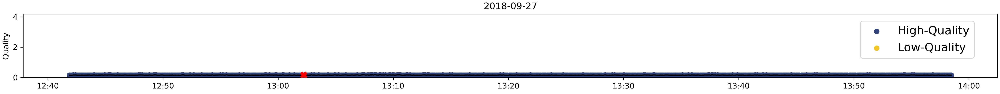
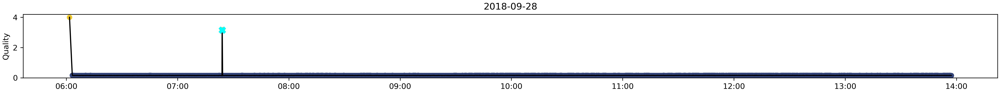
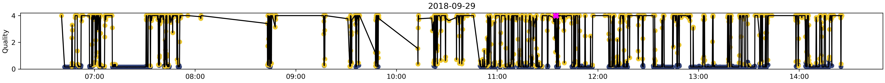
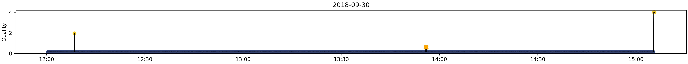
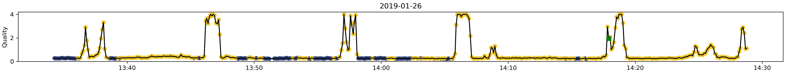
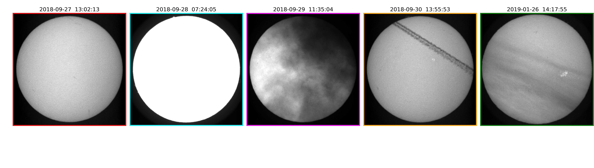

# Anomaly Detection and Image Quality Metric for Solar Images with Generative Adversarial Networks

## \>>> Watch the videos: [Quality-Scale](https://youtu.be/9MvdLDtxKBo), [2018-09-27](https://youtu.be/rJEe27osgTI), [2018-09-28](https://youtu.be/U-8uEmErupE), [2018-09-29](https://youtu.be/YygyymxqVFk), [2018-09-30](https://youtu.be/OlmC4BnD020), [2019-01-26](https://youtu.be/sCKDFREpJEw)
